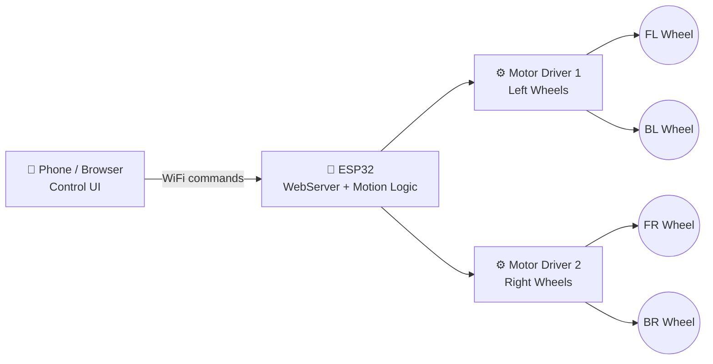

<div align="center">


<a href="https://github.com/baliemna2222-dev/ESP32-Mecanum-Robot">
  
</a>

<br/>


</div>

<br/>

## 🎯 About the Project

<table>
<tr>
<td width="60%" valign="top">

A collaborative build by **Emna Ben Ali** and **Mohamed Ben Ali** — an **ESP32-powered omnidirectional robot** built on **mecanum wheels**, giving it true **360° freedom of movement** — forward, backward, sideways, diagonal, and pure rotation — all without turning its chassis. Every command is sent wirelessly over **WiFi**, so the robot responds live with **zero lag control** from a browser or app interface.

No Ackermann steering. No blind spots. No wasted turning radius.
Just pure, fluid, omnidirectional motion.

</td>
<td width="40%">

```
     ↖  ↑  ↗
      \ | /
   ←— [ROBOT] —→
      / | \
     ↙  ↓  ↘

  + full rotation ⟳
```

</td>
</tr>
</table>

<div align="center">

</div>

> 🎥 *Replace the GIF above with your own robot demo — a screen recording of the WiFi controller in action + robot moving looks incredible here.*

---

## ✨ Key Features

<div align="center">

| 🚀 | Feature | Description |
|:---:|:---|:---|
| 🕹️ | **True Omnidirectional Motion** | Move in any direction — including diagonally and sideways — without rotating the chassis |
| 🔄 | **In-Place Rotation** | Spin 360° on the spot using differential mecanum wheel speeds |
| 📡 | **WiFi Wireless Control** | ESP32 hosts a control interface accessible from any phone, tablet, or laptop on the network |
| ⚡ | **Real-Time Responsiveness** | Low-latency command handling for smooth, instant reactions |
| 🎨 | **Custom Control Interface** | Clean, intuitive directional UI for precision driving |
| 🔧 | **Modular Firmware** | Motor logic, WiFi server, and control parsing separated for easy expansion |

</div>

---

## 🧠 How Mecanum Motion Works

<div align="center">

</div>

Each mecanum wheel has rollers angled at 45° around its circumference. By spinning all four wheels at *independent* speeds and directions, their combined force vectors let the robot glide in **any direction** without changing orientation.

```
        FRONT
   [FL]◤     ◥[FR]
     ↖ roller    roller ↗
        
   [BL]◣     ◢[BR]
     ↙ roller    roller ↘
        BACK

  Strafe Right  →  FL:+ FR:− BL:− BR:+
  Strafe Left   →  FL:− FR:+ BL:+ BR:−
  Diagonal ↗    →  FL:+ FR:0 BL:0 BR:+
  Rotate CW ⟳   →  FL:+ FR:− BL:+ BR:−
```

---

## 🛠️ Hardware Stack

<div align="center">

| Component | Purpose |
|:---|:---|
| **ESP32 Dev Board** | Main controller — runs WiFi server + motion logic |
| **4× Mecanum Wheels** | Omnidirectional locomotion |
| **4× DC Motors** | One per wheel, independently driven |
| **Motor Driver(s)** (L298N / TB6612FNG) | PWM speed + direction control per motor |
| **Power Supply / Battery Pack** | Powers motors + ESP32 logic (separate rails recommended) |
| **Chassis** | Mounts motors, wheels, battery, and electronics |

</div>

---

## 📡 System Architecture



---

## 🚀 Getting Started

### 1️⃣ Flash the Firmware
```bash
git clone https://github.com/baliemna2222-dev/ESP32-Mecanum-Robot.git
cd ESP32-Mecanum-Robot
# Open in Arduino IDE / PlatformIO
# Select board: ESP32 Dev Module
# Update your WiFi SSID + password in the config
```

### 2️⃣ Wire It Up
Connect each motor driver channel to its assigned ESP32 GPIO pins as defined in the firmware's pin config section.

### 3️⃣ Power On & Connect
The ESP32 boots and hosts a WiFi access point / joins your network. Connect from your phone or laptop to the printed IP address.

### 4️⃣ Drive!
Open the control interface in your browser and start moving — forward, strafe, diagonal, or spin in place.

---

## 🕹️ Control Interface Preview

<div align="center">

```
        ⬉   ⬆   ⬈
          ↖  |  ↗
    ⬅ ————[●]———— ➡
          ↙  |  ↘
        ⬋   ⬇   ⬊

          ⟲    ⟳
        rotate left/right
```

</div>

---

## 🗺️ Roadmap

- [x] Core mecanum drive logic
- [x] WiFi command server on ESP32
- [x] Web-based directional controller
- [ ] Speed slider / joystick-style control
- [ ] Obstacle avoidance with ultrasonic sensor
- [ ] Live camera streaming module
- [ ] Mobile app (BLE/WiFi hybrid) version
- [ ] Autonomous path-following mode

---

## 🤝 Contributing

Contributions, issues, and feature requests are welcome!
Feel free to check the [issues page](../../issues) or open a pull request.

---

## 👥 Collaborators

<div align="center">

<table>
<tr>
<td align="center">
<br/>
<sub>Firmware · WiFi Control Logic · UI</sub>
</td>
<td align="center">
<br/>
<sub>Hardware · Motor & Mecanum Drive System</sub>
</td>
</tr>
</table>

*A collaborative build — designed, wired, and coded together.*

</div>

---

## 🎬 Inspiration

This project was inspired by the excellent ESP32 WiFi mecanum wheel build tutorial by **Robot Lk**:

📺 [ESP32 WiFi Mecanum Wheel Robot – Full Build & Web Control Tutorial](https://www.youtube.com/watch?v=nbYb-EFjuI0)

Our implementation builds on the core concept — WiFi-driven mecanum control on an ESP32 — with our own firmware structure, wiring, and control interface.

---

<div align="center">

### 💗 Built with curiosity, ESP32s, and a lot of trial-and-error


<br/><br/>


</div>
